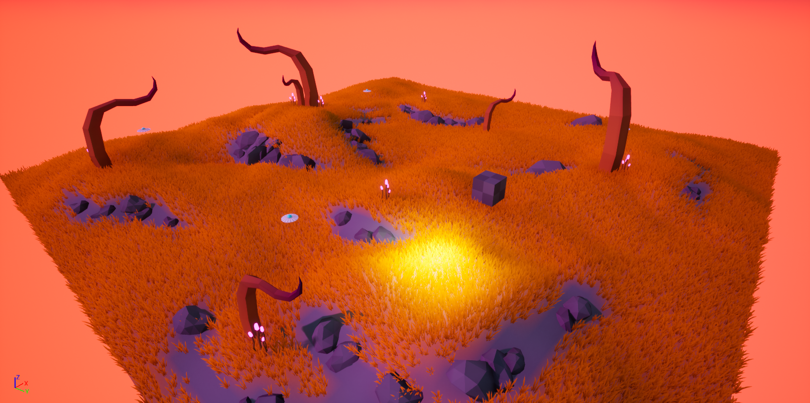

# Alien World Demo
   

 

<h2>🗒️ Project Description</h2>

 

The Alien World Demo was a project created to utilize and familiarize myself with the terrain tools available within Unreal Engine 4. 
Some aspects of this project include: 
  - Using multi-layered materials to paint the terrain
  -  procedural 3D grass placement based on terrain layer
  -  3D modelling of foliage and terrain obstacles
  -  Creating a custom color profile for the world skybox to create an alien atmosphere

There are some additional elements that were a part of this project, such as physics-based interactions and 3D audio, but the world building was the primary focus.

 

  
  

  
  

 

<h2>🛠️ Tools Used</h2>

 

 [Unreal Engine 4] - Primary Game Engine

 [Blender] - 3D Modelling

 [Git] - Source Control

 

 

<h2>🧠 Project Reflection</h2>

- **How would you describe the process of creating and polishing the artifact?**
  
I feel that creating and polishing this artifact was very enjoyable, as it really allowed me to use creativity and my imagination. For this project, I really wanted to focus on creating the atmosphere of a game level while also attempting to make all of the assets: such as sound, models, materials, and more, myself. I feel that I was really able to accomplish this, creating a very specific, alien-like atmosphere within the level, even though it is only a small demo area.
  
- **What did you learn as you were creating it and improving it?**

This project gave me a change to become more familiar with the terrain tools, materials, and sound effect tools within Unreal Engine 4. I was really excited to learn about the dynamic grass placement based on the material used within the terrain, as well as creating dynamic movement and gradients within a material using their material editor. Along with this, I was able to continue refining my skills within Blender, though I have already had quite a bit of experience using this tool in the past.

- **What challenges did you face?**

Honestly, I feel that there were not really any challenges within this project, as it was heavily focused on just trying things out and having fun with it. Some things needed to be redesigned, as I did not like how they fit with the rest of the environment, but that was about as challenging as it got.

- **How did you incorporate feedback as you made changes to the artifact?**

Similar to many of my other projects, feedback was incorporated by keeping a solid lane of communication open between me and the client, in this case a professor. As this was more of just a creative project, this required a minimal amount of feedback other than ensuring overall functionality of the artifact.

- **How was the artifact improved?**

The artifact originally contained a terrain with materials applied and the UFOs placed around the map as cones. This artifact was improved by introducing fully materialled custom models to almost every aspect of the terrain and the objects placed around the terrain. Along with this, grass was added to the terrain that is dynamically placed based on the material used at that position on the terrain.

 
